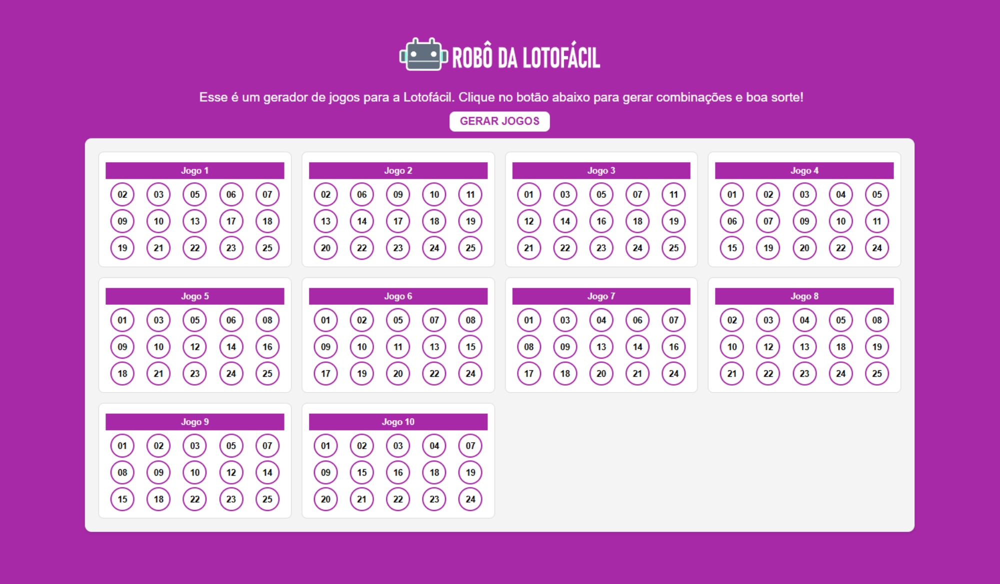

# Robo da Lotofácil

## Sobre o projeto

Um site simples que simula um robô de recomendação para jogos da lotofácil. (Todos os jogos são gerados de forma aleatótia. É apenas uma simulação.)

## Como utilizar

Clique no botão "Gerar Jogos" para que sejam gerados 10 jogos de 15 numeros cada.

## Informações

Projeto desenvolvido utilizando apenas HTML, CSS e JavaScript.

